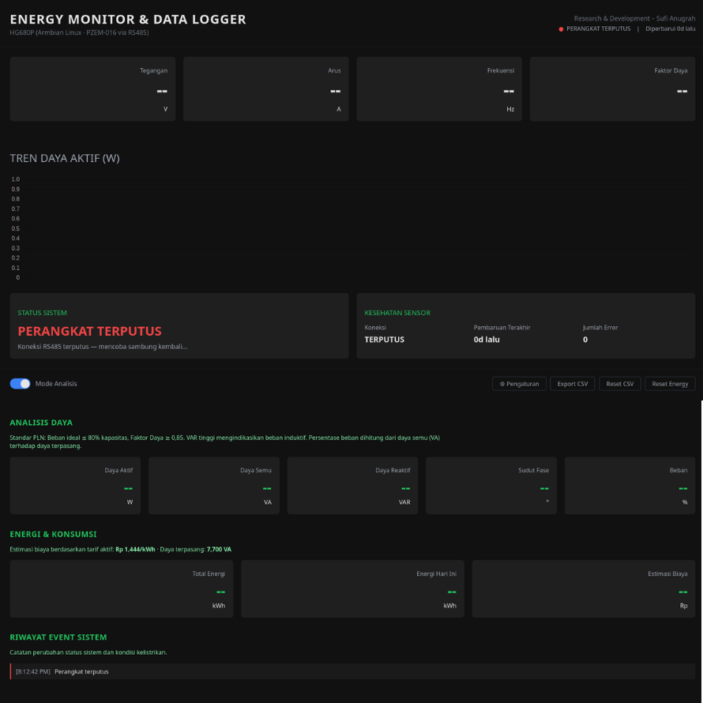
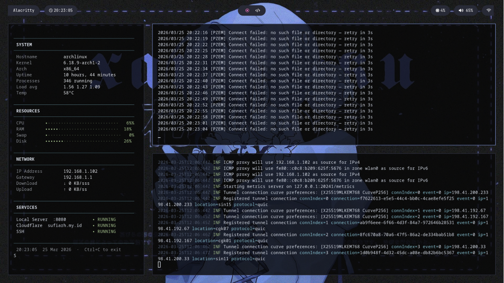

# ⚡ Energy Monitor & Data Logger

> A real-time electrical energy monitoring system built on embedded Linux. It reads power measurements from a PZEM-016 sensor over RS485/Modbus RTU, processes and logs the data with Go, serves a web dashboard on the local network, and exposes it to the internet via Cloudflare Tunnel.

**Platform:** HG680P STB (Armbian Linux · ARM Cortex-A53)  
**Sensor:** PZEM-016 AC Power Meter via RS485 USB Adapter  
**Research Location:** Student Dormitory, Mulawarman University, Samarinda, Indonesia  
**Author:** Sufi Anugrah

---

## 📸 Dashboard Preview



*Figure 1 — Dashboard*



*Figure 1 — Running Golang and tunneling Cloudflare in background*

---

## 🗂 Project Structure

```
pzem-go/
├── main.go              # Main application (Go)
├── go.mod               # Go module definition
├── go.sum               # Go module checksums
├── config.json          # Runtime config — tariff & rated power (auto-generated)
├── config.json.example  # Configuration template
├── energy_state.json    # Daily energy tracking state (auto-generated)
└── web/
    ├── index.html       # Main dashboard page
    ├── login.html       # Login page
    ├── app.js           # Frontend logic (polling, rendering)
    └── style.css        # Dashboard stylesheet
```

> `history.csv`, `history.jsonl`, and `events.jsonl` are generated automatically at runtime and are excluded from the repository via `.gitignore`.

---

## 🔧 Hardware

| Component | Specification |
|---|---|
| **Single Board Computer** | HG680P (ARM Cortex-A53, 2 GB RAM) |
| **Operating System** | Armbian Linux (Ubuntu base, arm64) |
| **Power Meter** | PZEM-016 (AC, up to 100 A) |
| **Interface** | RS485 via USB-to-RS485 Adapter |
| **Serial Port** | `/dev/ttyUSB0` — 9600 baud, 8N1 |
| **Remote Access** | Cloudflare Tunnel |

### RS485 Wiring

```
PZEM-016              USB-RS485 Adapter
   A+ ─────────────── A
   B- ─────────────── B
  GND ─────────────── GND
```

---

## 🚀 Getting Started

### Prerequisites

- Go 1.21+ installed on the ARM device
- USB-to-RS485 adapter recognized as `/dev/ttyUSB0`
- PZEM-016 wired to the AC line being monitored
- (Optional) Cloudflare account for public access

### 1. Clone & Build

```bash
git clone https://github.com/sufiarh/energy-monitor-logger
cd energy-monitor-logger
go mod tidy
go build -o energy-monitor-logger .
```

### 2. Configure

Copy the example config and edit as needed:

```bash
cp config.json.example config.json
```

```json
{
  "tariff": 900,
  "max_va": 7700
}
```

| Field | Description |
|---|---|
| `tariff` | Electricity tariff in IDR per kWh (default: 900) |
| `max_va` | Rated power of the installation in VA (default: 7700) |

> Configuration can also be updated live from the web dashboard without restarting.

### 3. Run

```bash
sudo ./energy-monitor-logger
```

> Root/sudo is required to open the serial port `/dev/ttyUSB0`.  
> Alternatively, add your user to the `dialout` group: `sudo usermod -aG dialout $USER`

Open the dashboard at: **http://localhost:8080**

Default password: `asiap1234`  
*(Change this in `main.go` before deploying to a public environment.)*

---

## 🌐 Public Access via Cloudflare Tunnel

To expose the dashboard securely to the internet:

```bash
# Download cloudflared for ARM64
curl -L https://github.com/cloudflare/cloudflared/releases/latest/download/cloudflared-linux-arm64 \
     -o cloudflared
chmod +x cloudflared

# Authenticate with your Cloudflare account
./cloudflared tunnel login

# Create a named tunnel
./cloudflared tunnel create energy-monitor-logger

# Start the tunnel
./cloudflared tunnel --url http://localhost:8080
```

---

## 🔄 Run as a systemd Service

To start automatically on boot:

```bash
sudo cp energy-monitor-logger.service /etc/systemd/system/
# Edit WorkingDirectory and ExecStart paths inside the file to match your setup
sudo systemctl daemon-reload
sudo systemctl enable energy-monitor-logger
sudo systemctl start energy-monitor-logger
sudo systemctl status energy-monitor-logger
```

---

## 📊 Features

### Real-time Monitoring
- Polls PZEM-016 every **1 second** via Modbus RTU
- Displays: Voltage (V), Current (A), Active Power (W), Energy (kWh), Frequency (Hz), Power Factor
- Calculates: Apparent Power (VA), Reactive Power (VAR), Phase Angle (°), Load Percentage (%)
- Daily energy cost estimate based on configurable electricity tariff

### Power Quality Detection

| Status | Condition |
|---|---|
| `NORMAL` | 198 V ≤ V ≤ 231 V **and** 49.5 Hz ≤ f ≤ 50.5 Hz |
| `UNDER_VOLTAGE` | Voltage < 198 V |
| `OVER_VOLTAGE` | Voltage > 231 V |
| `UNDER_FREQUENCY` | Frequency < 49.5 Hz |
| `OVER_FREQUENCY` | Frequency > 50.5 Hz |

### Data Logging

| File | Format | Content |
|---|---|---|
| `history.jsonl` | JSONL | All measurements at 1-second resolution |
| `history.csv` | CSV | Snapshot every 10 minutes (NORMAL), or immediately on any abnormal event |
| `events.jsonl` | JSONL | System events: connect, disconnect, alarms, config changes |

### Daily Energy Tracking
- Automatic daily energy rollover at midnight
- State persisted to `energy_state.json` — survives restarts

### Web Dashboard
- Cookie-based session authentication (24-hour TTL)
- Live update every 1 second
- Engineer Mode: full technical detail view
- CSV data export
- Live tariff & rated-power configuration
- PZEM energy counter reset button

---

## 🔌 API Reference

| Method | Endpoint | Description |
|---|---|---|
| `POST` | `/api/login` | Authenticate with password |
| `GET` | `/api/logout` | Invalidate session and redirect to login |
| `GET` | `/api/realtime` | Latest measurement snapshot |
| `GET` | `/api/config` | Get current configuration |
| `POST` | `/api/config` | Update tariff and rated power |
| `GET` | `/api/export` | Download `history.csv` |
| `POST` | `/api/reset-energy` | Reset the PZEM internal energy counter |
| `POST` | `/api/reset-csv` | Delete and restart `history.csv` |

### Sample `/api/realtime` Response

```json
{
  "metrics": {
    "ts": "2026-04-20T10:30:00+08:00",
    "voltage": 220.3,
    "current": 0.412,
    "power": 89.4,
    "energy": 25.651,
    "frequency": 49.9,
    "pf": 0.98,
    "system_status": "NORMAL"
  },
  "device": {
    "connected": true,
    "status": "NORMAL",
    "last_seen": "2026-04-20T10:30:00+08:00",
    "error_count": 0
  },
  "energy_today": 0.512,
  "config": {
    "tariff": 900,
    "max_va": 7700
  }
}
```

---

## 📦 Dependencies

| Package | Purpose |
|---|---|
| [`github.com/goburrow/modbus`](https://github.com/goburrow/modbus) | Modbus RTU communication over serial port |
| [`github.com/goburrow/serial`](https://github.com/goburrow/serial) | Serial port driver (indirect dependency) |

---

## ⚠️ Security Notes

This project was built for **research purposes in a controlled environment**. Before deploying publicly:

- [ ] Replace the hardcoded password (`asiap1234`) in `main.go` with an environment variable or hashed credential
- [ ] HTTPS is already handled by Cloudflare Tunnel — do not expose port 8080 directly to the internet
- [ ] Consider adding rate limiting to the `/api/login` endpoint
- [ ] Never commit `config.json` with sensitive runtime data to a public repository

---

## 📝 License

Built for research purposes at Mulawarman University.  
Free to use and modify for educational and non-commercial purposes.

---

## 👤 Author

**Sufi Anugrah**  
Researcher — Student Dormitory, Mulawarman University  
Samarinda, East Kalimantan, Indonesia
